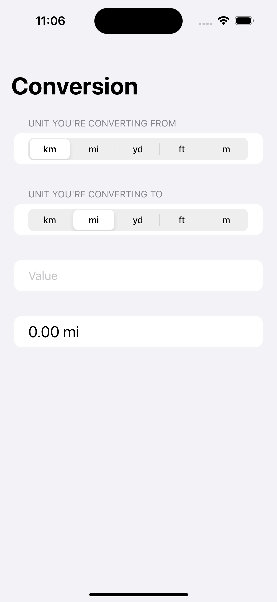

# Unit Conversion App

This is a simple unit conversion app built in Swift, designed to convert between kilometers, miles, yards, feet, and meters. It allows users to input a value, select the original unit, select the desired unit, and then displays the converted value.

## Features

- Conversion between kilometers, miles, yards, feet, and meters
- User-friendly interface with text input and picker views
- Real-time conversion updates as the user interacts with the app

## Screenshots



## Getting Started

To get a local copy of the project up and running, follow these steps:

1. Clone the repository:

```shell
git clone https://github.com/SimphiweLuthando/unit-conversion-app.git
```
2. Open the project in Xcode.
3. Build and run the app on the simulator or a physical device.

## Usage

1. Enter a numeric value in the provided text field.
2. Select the original unit from the "From Unit" picker.
3. Select the desired unit from the "To Unit" picker.
3. The converted value will be displayed below the pickers.

## Contributing

Contributions are welcome! If you have any suggestions, bug reports, or feature requests, please open an issue or submit a pull request.
